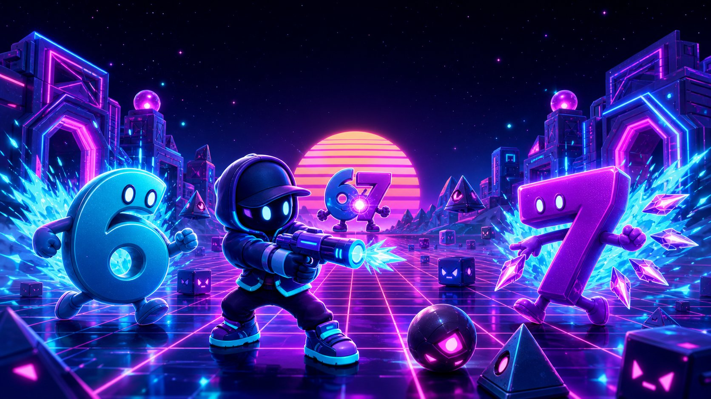

<div align="center">



# 💀 MEME ARENA 3D

**Um shooter de arena 3D que roda direto no navegador.**
Sobreviva a ondas infinitas de memes, escolha perks, derrube chefes gigantes.

[**▶ JOGAR AGORA**](https://mathpvp2080.github.io/meme-arena-3d/)

`Three.js` · `WebGL` · `WebAudio` · **zero dependências em runtime** · **zero build**

</div>

---

## 🎮 Sobre

A internet colapsou e o **Brainrot** vazou dos servidores: os memes ganharam forma 3D.
Você é o **Chill Guy**, o último com dopamina suficiente pra resistir. Segure a arena.

### Temporada 1 · 67

- **Período:** 03/10/2026 a 28/11/2026; a próxima temporada começa em 29/11/2026.
- Identidade visual própria em azul elétrico, rosa-magenta, ciano e violeta, com a **Arena 67**.
- **Caixa 67** e **Cofre 67**, comprados somente com moedas virtuais. As chances ficam
  visíveis na loja e a 7ª abertura sem equipamento garante um item sazonal.
- Conteúdo exclusivo: **4 skins, 3 armaduras, 4 armas e 3 habilidades**, incluindo
  Corredor 67, Seis em Órbita, Sete Quebra-Loop e Fusão 67. Os modelos 3D são próprios.
- **Impulso 67** concede +67% de moedas e XP na próxima partida; duplicatas viram
  fragmentos e 67 fragmentos forjam um item sazonal que ainda falta.
- O mercado usa limites mínimo e máximo **específicos por item**, e o jogador escolhe
  o valor do anúncio dentro dessa faixa.
- A temporada usa o conceito numérico do meme. Não inclui música, voz, foto ou
  arte da trend; ambientes, efeitos e sons são autorais. Os modelos 3D externos
  são identificados e creditados conforme suas licenças.

Jogadores, equipamentos, efeitos e os visuais de reserva dos NPCs são gerados
proceduralmente com geometrias primitivas e texturas em `<canvas>`. Os quatro inimigos
ativos usam modelos GLB creditados, com fallback procedural se um arquivo falhar. A
entrada e o lobby usam duas artes autorais da Temporada 67; a trilha e os efeitos são
sintetizados com WebAudio.

## ✨ Funcionalidades

| | |
|---|---|
| 🧟 **4 inimigos** | Doge Corrompido, Tralalero Tralala, Tung Tung Sahur e Bombardiro Crocodilo |
| 👹 **4 chefes** | Versões gigantes de Doge, Tralalero, Tung Tung e Bombardiro, em rotação a cada 5 ondas |
| 🔫 **9 armas** | Laser, shotgun, bumerangue, RPG, orbe gravitacional, minigun, prisma, railgun e Pulso 67 |
| ✦ **3 habilidades** | Repulsão 6, Passo 7 e Sobrecarga 67 com mecânicas e recargas próprias |
| 🃏 **20 perks** | Escolha 1 de 3 cartas a cada onda. Comuns, raras e épicas. Acumulam entre si |
| 🧠 **Ultimate** | Encha o medidor de Brainrot e vire invencível com dano x1.8 e cadência dobrada |
| 🎁 **6 itens** | Cura, dano dobrado, velocidade, escudo, overdrive e a Nuke de Meme |
| 👑 **Elites** | Inimigos com coroa dourada: 2.6x vida e 2.4x pontos |
| 🤖 **7 tipos de IA** | Perseguir, flanquear, orbitar, atirar, investir, teleportar e bombardear |
| 📊 **4 dificuldades** | Normie, Meme Lord, Sigma e Brainrot |
| 🏆 **Progressão** | Combo multiplicador, 7 ranks, recordes locais e estatísticas de fim de partida |
| 📱 **Mobile** | Joystick virtual, botões de ação e layout responsivo |
| 🔌 **Offline** | PWA com service worker — instala e joga sem internet |

## 🕹️ Controles

| Tecla | Ação |
|---|---|
| `W` `A` `S` `D` | Mover |
| `Mouse` | Olhar / mirar |
| `Clique esquerdo` | Atirar |
| `Espaço` | Pular |
| `Shift` | Dash (com frames de invencibilidade) |
| `Q` / `Roda` / `1`–`3` | Trocar entre as armas equipadas |
| `F` | Usar habilidade especial equipada |
| `E` | Ultimate (Brainrot em 100%) |
| `Esc` / `P` | Pausar |
| `M` | Mudo |

No celular: joystick à esquerda, botões de ação à direita, arraste na tela para olhar.

## 🚀 Publicar no GitHub Pages

O projeto é **estático puro** — não precisa de build, bundler nem Node.

```bash
git init
git add .
git commit -m "feat: Meme Arena 3D"
git branch -M main
git remote add origin https://github.com/mathpvp2080/meme-arena-3d.git
git push -u origin main
```

Depois, no GitHub: **Settings → Pages → Source: `Deploy from a branch` → Branch: `main` / `(root)` → Save**.

Em ~1 minuto o jogo estará em `https://mathpvp2080.github.io/meme-arena-3d/`.

> Já existe um workflow em `.github/workflows/deploy.yml` caso prefira usar
> **Settings → Pages → Source: GitHub Actions**. Os dois caminhos funcionam.

## 💻 Rodar localmente

Precisa de um servidor HTTP — abrir o `index.html` por `file://` não funciona
(o navegador bloqueia o carregamento dos scripts).

```bash
python3 -m http.server 3000
# ou
npx serve .
```

Acesse `http://localhost:3000`.

## 📁 Estrutura

```
meme-arena-3d/
├── index.html              # markup do jogo e de todas as telas
├── css/style.css           # HUD, menus, cards de perk, responsivo
├── src/
│   ├── utils.js            # helpers, storage, polyfill de CapsuleGeometry
│   ├── data.js             # inimigos, chefes, armas, perks, dificuldades
│   ├── audio.js            # síntese WebAudio + trilha gerativa adaptativa
│   ├── textures.js         # texturas procedurais em canvas
│   ├── world.js            # arena, luzes, céu, obstáculos e colisão
│   ├── entities.js         # pool de partículas, jogador, inimigos, itens
│   ├── ui.js               # HUD, radar, feed de abates, telas
│   └── game.js             # loop, input, combate, ondas e fluxo
├── lib/three.min.js        # Three.js r128 (local, sem CDN)
├── assets/                 # favicon e capa
├── sw.js                   # service worker (offline)
└── manifest.webmanifest    # PWA
```

## 🛠️ Detalhes técnicos

- **Pool de partículas** de 520 meshes reutilizadas — sem alocação durante o combate.
- **Cache de geometrias** por tipo de inimigo; só os materiais são clonados.
- **3 níveis de qualidade** que ajustam pixel ratio, sombras, número de luzes e densidade de partículas.
- **Trilha adaptativa**: a intensidade da música sobe junto com o número da onda e no Ultimate.
- **Correção de cor**: todas as texturas em `sRGBEncoding` com tone mapping ACES Filmic.
- Validação automatizada com `npm test`: catálogo, referências, assets, PWA, convidado e patch SQL.

### Console de debug

```js
MEMEARENA.skipToWave(5)   // pula direto pro primeiro chefe
MEMEARENA.god()           // vida infinita
MEMEARENA.perk('crit')    // concede um perk
MEMEARENA.nuke()          // limpa a tela
MEMEARENA.kill()          // força o game over
```

## 📄 Licença

MIT — use, modifique e publique à vontade.
Three.js é distribuído sob a licença MIT (© three.js authors).

## 👤 Contas, economia e progressão (novo)

- **Conta com nome e senha** — sem e-mail real. Não existe recuperação automática,
  então a senha deve ser guardada. O modo **Convidado** usa somente `sessionStorage`,
  termina com a sessão e nunca cria usuário no Supabase.
- Para publicar o backend, aplique [`supabase/schema.sql`](supabase/schema.sql) e depois
  o patch único [`supabase/DEPLOY_LAUNCH.sql`](supabase/DEPLOY_LAUNCH.sql).
- **Todo jogador começa igual**: skin *Chill Guy*, armadura *Moletom Básico* e
  **600 moedas** — o bastante para comprar a arma inicial (Laser de Doge, 450).
- **Nível e XP** até o nível 60. Ganhe XP e moedas a cada partida (pontos,
  abates, ondas e chefes, multiplicados pela dificuldade).
- **Loja e inventário** com 14 skins, 9 armaduras, 9 armas, 3 habilidades e caixas
  sazonais. As armaduras dão **+HP** e **redução de dano**, e aparecem no boneco 3D.
- **Inventário** para equipar (até 3 armas ao mesmo tempo) e **vender** itens
  por 50% do preço.
- **Multiplayer** destrava no **nível 5** (chega na Etapa 3).

> As armas não são mais liberadas por onda: agora você as **compra e equipa**.

## 🎭 NPCs e mapas (Etapa 2)

- **Quatro inimigos com GLB próprio**: Doge Corrompido, Tralalero Tralala,
  Tung Tung Sahur e Bombardiro Crocodilo.
- **Quatro chefes gigantes** reutilizam os mesmos modelos em escala maior:
  Doge Supremo, Tralalero Colossal, Tung Tung Titã e Bombardiro Crocodilo.
  Eles se alternam a cada cinco ondas e ficam mais fortes a cada nova rotação.
- **Fallback procedural** mantém cada inimigo e chefe jogável se o carregamento
  externo falhar; barra de vida, brilho, colisão e IA permanecem separados do visual.
- **5 mapas** que mudam céu, chão, névoa, luzes, obstáculos e cartazes:

| Mapa | Libera no nível |
|---|---|
| 6⁷ Arena 67 | 1 |
| 🌽 Planície de Ohio | 4 |
| 🚽 Esgoto Skibidi | 9 |
| 🦈 Praia Italiana | 15 |
| 🧠 Servidor do Algoritmo | 22 |

## 🌐 Multiplayer (Etapa 3 — parte 1)

Libera no **nível 5**. No hub, botão **🌐 MULTIPLAYER**.

- **CO-OP** — até 4 jogadores contra as ondas de memes. O anfitrião comanda os
  inimigos e todo mundo vê exatamente os mesmos monstros, no mesmo lugar.
- **PVP** — todos contra todos em tempo real; primeiro a 10 abates vence.
- Sala com **código de 4 letras** para chamar os amigos, mais a lista de
  **salas abertas** para entrar em um clique.
- Quem cai renasce sozinho (7s no co-op, 4s no PvP).

Para funcionar pela internet é preciso rodar `supabase/schema_multiplayer.sql`
no SQL Editor do Supabase. Sem isso, o multiplayer ainda funciona em **modo
local** entre abas do mesmo navegador.

O mercado de itens (vender/presentear) usa o mesmo SQL. A coleção da Temporada 67
tem 14 itens entre skins, armaduras, armas e habilidades, obtidos originalmente
em Caixas 67 ou por drop aleatório de chefe. Depois, eles podem ser revendidos no
mercado dentro das faixas individuais validadas pelo servidor.

## Créditos de recursos externos

Os créditos, fontes, licenças e adaptações dos modelos 3D de terceiros estão
registrados em [`ATTRIBUTIONS.md`](ATTRIBUTIONS.md) e também aparecem dentro do
jogo em **Opções → Créditos dos modelos 3D**.
